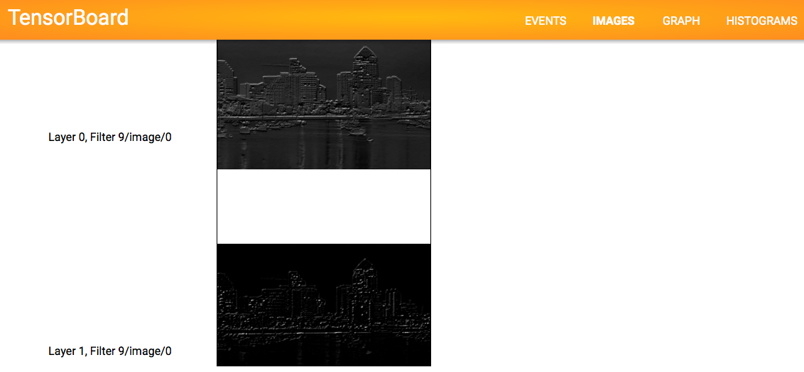

# VGG Visualizer in TensorFlow

Visualize the features of the VGG (and illustration2vec) convolutional neural network.

TODO: find a way to group the images by layers somehow (setting the scope did not work...)

##Usage

### Step 0: Prepare the Caffe model
First, download either the VGG model or the illustration2vec model (\*.caffemodel), along with the prototxt (\*.prototxt):

- VGG: [https://gist.github.com/ksimonyan/211839e770f7b538e2d8#file-readme-md](https://gist.github.com/ksimonyan/211839e770f7b538e2d8#file-readme-md)
- illustration2vec: [http://illustration2vec.net/](http://illustration2vec.net/)   (pre-trained model for tag prediction, version 2.0)

Then, convert the model to a binary format recognizable to TensorFlow:

	python ./kaffe/kaffe.py [path.prototxt] [path.caffemodel] [output-path]

Note that Caffe is *not* required for conversion.

The converter included in this repo (all code inside ./kaffe) is a modified version of (an old version of) https://github.com/ethereon/caffe-tensorflow . The converter is modified to be capable of handling the illusration2vec neural network. Since the newer version of the converter requires preprocessing with the Caffe framework for old-format Caffe models (at the time of writing), I have included the converter which is based on the older code, which is capable of handling old-format Caffe models. The new binary from the original repo of the converter can be used as well, if you are able to successfully convert the model and obtain the binary.

### Step 1: Run

	python vgg-visualizer.py

Running `vgg-visualizer.py` without options yields the default settings and input images. Available options are:

- `-m, --model`:      Model type - Use `vgg` or `i2v`
- `-mp, --modelpath`: Model file path - The path to the converted Caffe model in Step 0
- `-i, --input`:    Input image path
- `-w, --width`:      Input image resize target width (default: no resizing. Smaller images run faster and with fewer memory)
- `-x, --maxfilters`:      Maximum Nnumber of filters to show per layer

For example:

	python vgg-visualizer.py -m vgg -mp ./vgg -i ./images/sd.jpg -w 500 -x 20

### Step 2: Visualize

	tensorboard --logdir=/tmp/vgg-visualizer-logs

Then, access `http://localhost:6006` on your browser and browse "Images" to see the data.

### Customize
- Changing the definition of `def y(self):` in `models.py` changes which layer to visualize.
- Changing the `-x, --maxfilters` option lets you change the number of filters to visualize, per layer.
- Currently, the TensorBoard visualization is very "raw" and unorganized... If you let me know a way to group them I would greatly appreciate it :)

## References
- [https://github.com/ethereon/caffe-tensorflow](https://github.com/ethereon/caffe-tensorflow) : The Caffe model converter

- `./kaffe/caffepb.py` was referenced from [https://github.com/ethereon/caffe-tensorflow](https://github.com/ethereon/caffe-tensorflow).
- `./kaffe/kaffe.py`, `./network.py`, `./models.py` are modified versions originally from [https://github.com/ethereon/caffe-tensorflow](https://github.com/ethereon/caffe-tensorflow). (`./models.py` was originally `vgg.py`)
